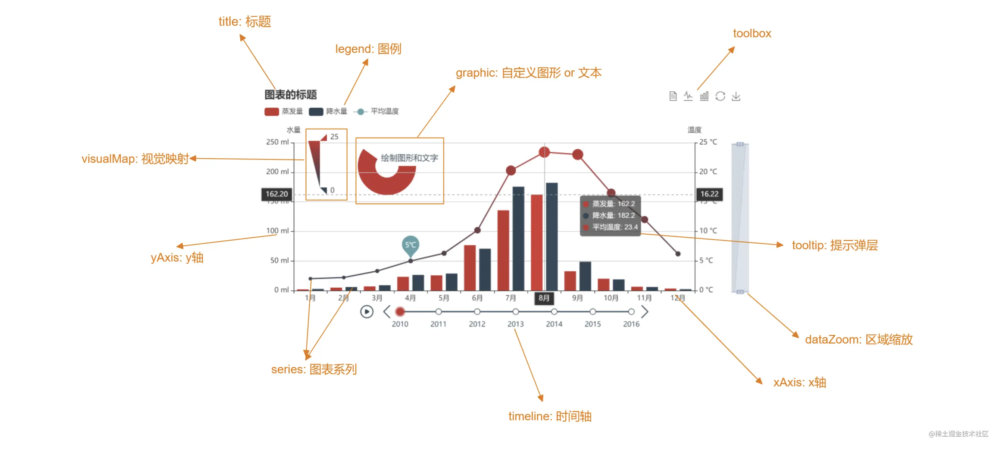

## Echarts
1. Echarts首先它是配置驱动的，最重要的API就是setOption，开发者只需要修改配置，就能让图表完成更新
   当我们希望图表从状态A更新到状态B，我们只需要组装好状态B的配置，交付给Echarts就可以了。
   
   常见的元素有title标题，legend图例，graphic自定义图像或者文本，toolbox工具栏，xAxis X轴，yAxis Y轴
   series图表系列，tooltip 提示弹层，timeline时间轴，dataZoom区域缩放
2. API:   
   （1） init，创建一个Echarts实例，它接收一个容器DOM元素作为参数，这个api也可以设置相应的皮肤（theme），
   设置renderer渲染模式（选择canvas或者svg渲染），可以设置实例的宽高，设置使用的语言locale
   （2） connect,将多个多个实例设置为同一组之后（group），就能用connect进行联动，比如折线图和饼图的联动，还有堆叠的柱状图和饼图的联动，disconnect解除联动
   （3）dispose ，销毁实例，通常是用来封装成组件的时候，在组件销毁前的生命周期里，将Echarts实例销毁
   （4）use这个api，就能完成按需注册组件
   （5）registerTheme,注册主题，可以在官网上配置主题（https://echarts.apache.org/zh/theme-builder.html），然后导出json，
   用registerTheme注册，然后在init初始化的时候选择注册的主题
      ```js
    import * as ECharts from "echarts";
    import theme from '@/theme/echarts-dark.json'

    ECharts.registerTheme('dark', theme)
   ```
   （6）setOption 可以设置图表实例的配置项和数据
   （7）resize，改变图表尺寸，ResizeObserver监听容器的变化，容器变化之后调用,Echarts的resize()
   （8）还有像getOption，getWidth，getHeight，getDom这样获取信息的api
   （9）用on和off来添加事件，解绑事件，on绑定事件，接收的参数是事件名称，像是点击事件，鼠标移动事件（mouseover），
       第二个参数是query，设置过滤条件，表示哪些元素才能触发事件，比如说点击柱状图的时候，进行页面跳转
       过滤
       ```js
       {
        componentType: 'series',
         seriesType: 'bar',
       }
       ```
    (10) showLoading,hideLoding,显示加载动画
    (11) getDataURL可以将图表导出成base64的图片
   （12）appendData 用来实现大量数据的分片加载

在Echarts中可以通过 dispatchAction 触发图表的行为:
（1）highlight，downplay 用来高亮图形和取消高亮，通常用来做表格联动图形
（2）legendSelect，legendUnSelect 用来选中图列和取消选中图例，当图例数量很多，展示不完，就能用legendScroll 来控制图例的滚动
（3）dataZoom行为，控制缩放
（4）timelineChange 设置时间轴的时间节点， timelinePlayChange更改时间轴的播放状态
（5）geoSelect 选择地图的区域
3. 地图：
   ```js
    echarts.registerMap("mapName",mapData)
    myEcharts.setOptions({
      geo:{
        map:'mapName',
        itemStyle:{
          areaColor:'地图中每个区块的颜色',
          borderColor:'边框颜色',
          shadowColor:'阴影颜色',
          shadowBlur:30 , // 阴影模糊度
          emphasis:{
            focus:'self' // 聚焦的时候高亮本身，其他区域变透明
          }
        },
        tooltip:{ // 提示弹层
          trigger:'item'
        },
        visualMap:{ // 视觉映射
           type:'continumous', // 延续类型
           min:100,
           max:5000,
           calculable:true, // 滑动效果
           inRange:{
            color:['颜色','颜色']
           },
           textStyle:{
            color:''
           }
        },
        serise:[
          {
            type:'scatter', // 散点图,
            itemStyle:{color:'red'},
            coordinateSystem:'geo', // 坐标系，地理坐标
            data:[
              {name:'上海',valie:[116,39,4396]}
            ]
          }
        ]
      }
    })
   ```
4. Echarts还具有一些基础功能，像是自适应容器的宽高，具备更换主题的能力，当数据为空时，自动展示提示
   除了基础能力，Echarts还提供了自定义的增强能力，比如 graphic

5. graphic 配置提供了图表，文本，图片,动画的渲染配置
   （1）比如我们要在原有的饼图外层渲染一张背景图片
   ```js
    graphic: [
      {
        type: 'image',
        style: {
          image: 'https://pic.zhangshichun.top/pic/circle.png',
          width: 150,
          height: 150
        },
        top: 'middle',
        left: 'center',
      },
    ]
   ```
   （2）背景动画逻辑
   ```js
    {
        type: 'image',
        // ... 其他配置暂且省略
        transition: 'rotation',
        originX: 75,
        originY: 75,
        keyframeAnimation: {
          duration: 3000,
          loop: true,
          keyframes: [{
              percent: 0.5,
              easing: 'linear',
              rotation: Math.PI
          }, {
              percent: 1,
              easing: 'linear',
              rotation: Math.PI * 2
          }]
        }
    }
   ```

6. 有家炼钢厂，和很多不同的供应点签了合同，每天都会有很多司机运原材料到这个炼钢厂，
   我们就用微信小程序里的onLocationChange API，做一个持续定位，将司机的定位信息，
   实时的进行上报，然后在数据大屏里将司机走的路径实时的展示到地图上，可以看到每个
   货车运的是什么物料，车的速度，然后车开到炼钢厂的停车场之后，就通过排号叫号的方式，
   让货车进场卸货

   ```js
    const map = new AMap.Map('container'); // 创建地图,可以设置2D还是3D，初始化的图层，中心点
    {
      viewMode: '2D',  // 默认使用 2D 模式
      zoom:11,  //初始化地图层级
      center: [116.397428, 39.90923]  //初始化地图中心点
    }

    new AMap.Marker // 添加标记
    // 创建信息窗体
    const infoWindow = new AMap.InfoWindow({ 
      isCustom: true,  // 使用自定义窗体
      content: '<div>HELLO,AMAP!</div>', // 信息窗体的内容可以是任意 html 片段
      offset: new AMap.Pixel(16, -45)
    });

    infoWindow.open(map, e.target.getPosition()); // 打开信息窗体

    // 添加折线
    const lineArr = [
      [116.368904, 39.913423],
      [116.382122, 39.901176],
      [116.387271, 39.912501],
      [116.398258, 39.904600]
    ];
    const polyline = new AMap.Polyline({
      path: lineArr,          // 设置线覆盖物路径
      strokeColor: "#3366FF", // 线颜色
      strokeWeight: 5,        // 线宽
      strokeStyle: "solid",   // 线样式
    });
   ```